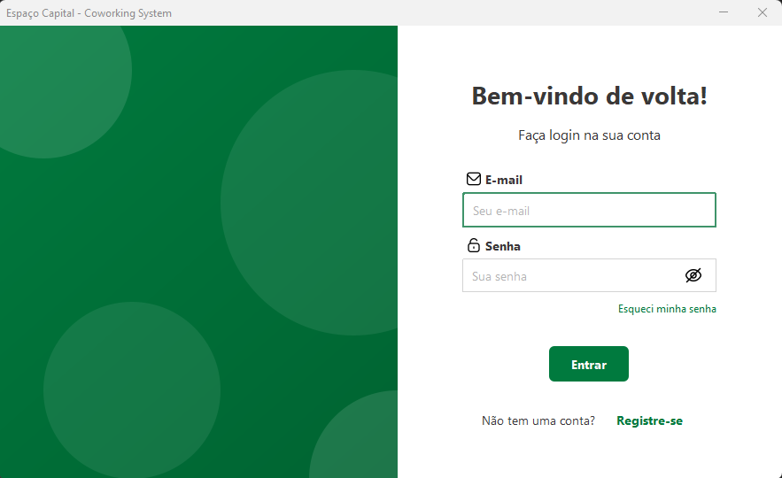

# ☕ Espaço Capital - Coworking System

Interface inicial de autenticação (login/registro) do sistema **Espaço Capital**, uma plataforma de agendamento para espaços de coworking. Este repositório representa a **entrega do REQ.1 - Cadastro de Usuários** e será expandido com novos módulos nas próximas versões.



---

## 📌 Status do Projeto

🛠️ **Em desenvolvimento**  
✅ Entrega atual: **REQ.1 - Cadastro de Usuários**  
🚧 Próximas entregas: Gestão de horários, agendamentos, espaços, pagamentos, relatórios...

---

## ✅ Funcionalidades Implementadas (REQ.1)

- Tela de login com campos personalizados
- Tela de registro com:
  - Validação de nome, e-mail e senha
  - Verificação de duplicidade de e-mail
  - Medidor de força da senha em tempo real
  - Validação de confirmação de senha
- Botões estilizados e com animações de interação
- Alternância animada entre login e registro
- Armazenamento local em arquivo `usuarios.csv`
- Tema visual moderno com **FlatLaf**
- Feedback visual com `JOptionPane`

---

## 📚 Requisitos Atendidos

**História do Usuário**  
> Eu, como novo usuário do sistema de agendamento de coworking, desejo me cadastrar informando meu nome, e-mail e senha, para que eu possa acessar a plataforma e realizar reservas de espaços.

**Validações Implementadas**
- Cadastro com dados válidos
- Detecção de e-mail duplicado
- Senha fraca ou confirmação incorreta bloqueiam o cadastro

---

## 📁 Estrutura

```bash
Coworking-System/
├── demo/
│   ├── src/
│   │   ├── main/
│   │   │   ├── java/
│   │   │   │   └── espaco_capita/
│   │   │   │       └── LoginUI.java
│   │   │   ├── resources/
│   │   │   │   ├── flyer1.png
│   │   │   │   └── icons/
│   │   │   │       ├── user.png
│   │   │   │       ├── email.png
│   │   │   │       ├── lock.png
│   │   │   │       ├── eye.png
│   │   │   │       └── eye-crossed.png
├── usuarios.csv
└── pom.xml

```
## 🔮 Próximas Entregas

- 📄 **REQ.2** - Gestão de Agenda e Horários  
  *Cadastro e validação de horários disponíveis para reserva, com prevenção de conflitos.*

- 📄 **REQ.3** - Agendamento de Espaços  
  *Permite que o usuário selecione um espaço e horário disponíveis para efetuar reservas.*

- 📄 **REQ.4** - Gestão de Espaços  
  *Cadastro, edição e remoção de espaços disponíveis no sistema.*

- 📄 **REQ.5** - Pagamentos e Controle Financeiro  
  *Integração com métodos de pagamento e controle de transações e reembolsos.*

- 📄 **REQ.6** - Notificações e Comunicação  
  *Envio automático de notificações e mensagens entre usuários e administradores.*

- 📄 **REQ.7** - Relatórios e Gestão Administrativa  
  *Geração de relatórios de uso dos espaços e dados financeiros com exportação em PDF/Excel.*

